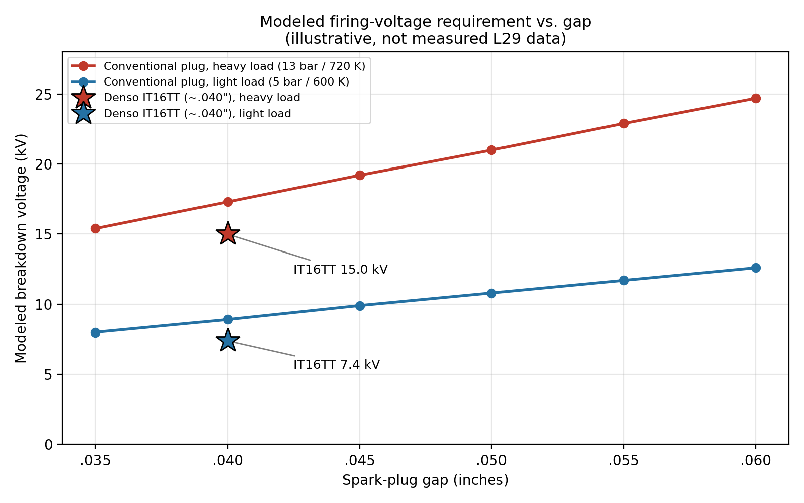
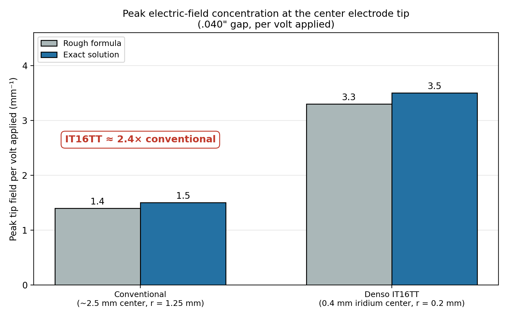

# Spark-Plug Gaps, Electrode Design & Selection Beyond the OEM Part Number

## Gap, Electrode Design, Firing Voltage, and Why the Rest of the Ignition System Matters

### Key takeaways

- **Gap:** Moving from .060 to about .040 inch cuts the modeled firing-voltage requirement by roughly a quarter, leaving more reserve for an aging crab-cap secondary system.
- **Electrode design:** A fine-wire tip concentrates the electric field about 2.4 times more strongly than a conventional large electrode. In the model, that translates to roughly 12–24% less firing voltage at the same gap.
- **Limits:** All of these numbers are illustrative estimates, not measured L29 data. A lower-demand plug does not fix a worn cap, rotor, or wires, and the correct heat range still comes first.

### Bottom line up front

On the L29, moving from the .060-inch plug gap listed in the ignition-system specifications to something around .040 inch will reduce the voltage the secondary ignition system has to develop before the spark jumps the gap, and may help the engine maintain more consistent ignition performance under load, where cylinder pressure drives firing-voltage demand higher. Requiring less voltage leaves more secondary-ignition reserve through the coil, distributor cap, rotor, plug wires, and insulation, and reduces the chance that age, moisture, carbon tracking, or other weaknesses become the easier electrical path. It can also help preserve reliable spark performance under load rather than spending so much of the system's available voltage margin just getting across the plug gap.

That general direction is also interesting in light of GM TSB #03-06-04-060B, which documents GM's move on a number of later V8 applications from platinum plugs to a newer iridium-tip plug manufactured with a .040-inch gap. The bulletin specifically attributes the gap change to the different firing-tip design. It does not apply directly to the L29, but it provides a useful GM example of how a change in electrode design can accompany a substantially smaller specified gap.

A newer fine-wire plug can potentially improve that situation further. Something like the Denso IT16TT combines a ~.040-inch gap with a 0.4 mm iridium center electrode and a 0.7 mm platinum ground electrode — the opposed fine-wire electrode design Denso markets as "Twin-Tip." The fine firing geometry typically requires somewhat less voltage than a conventional large-electrode plug at the same gap, while the precious-metal construction helps preserve that geometry and gap over time. In the like-for-like model described later in this article, the IT16TT's modeled firing-voltage requirement comes out roughly 12–24% lower than a conventional plug at the same gap, and roughly a third to 40% lower than a conventional .060-inch plug. Those are illustrative estimates, not measured L29 data.

So the attraction for me is not horsepower or a "magic" spark plug. It is the combination of a more moderate gap and a modern fine-wire design that should give the engine a good, durable spark while asking less from the rest of the secondary ignition system. That does not mean .060 inch cannot work, or that everyone should run the same plug. A fresh, healthy ignition system typically handles the wider gap just fine. My interest is in preserving more ignition margin, helping maintain stronger and more consistent ignition performance under heavy load, and reducing unnecessary secondary-system stress — particularly on an L29 still using the Vortec crab-cap distributor.

*Estimated spark voltage needed, relative to a regular .060" plug at normal load. Illustrative model results, not measured L29 data. Details below.*

**Note:** Lots of discussion follows for anyone interested in diving much deeper into the *why* behind the BLUF.

What started out as me comparing two spark plugs turned into a much deeper look at how spark-plug gap, electrode design, cylinder pressure, temperature, and the condition of the ignition system all work together. The L29 7.4L Vortec is an especially interesting engine to look at because the factory information itself raises questions. In the 1997 service manual, the engine-mechanical specifications list a .035-inch spark-plug gap, while the ignition-system specifications later list .060 inch. That discrepancy is what originally sent me down this rabbit hole.

GM's later TSB #03-06-04-060B is also interesting in this context. It does not apply directly to the L29, but it documents GM changing a number of later V8 applications from older platinum plugs to an iridium-tip plug manufactured at .040 inch because of the different firing-tip design. I think that is useful context when considering whether a .060-inch gap should automatically be treated as necessary regardless of electrode design.

I first looked at the ACDelco R44LTS as a conventional tighter-gap alternative. Then I came across the Denso IT16TT, which is already configured around a ~.040-inch gap and uses manufacturer-stated 0.4 mm iridium center and 0.7 mm platinum ground electrodes. The R44LTS represents the conventional large-electrode plug design commonly associated with the tighter-gap approach on these engines, while the IT16TT uses a much finer iridium/platinum electrode design that became far more common in later production spark plugs. At that point, the question became less about brands and more about what the plug is actually asking the ignition system to do.

Before going further, I also wanted to make sure I was comparing plugs with appropriate basic fitment. The R44LTS uses a 14 mm thread, 17.5 mm reach, tapered seat, and 5/8-inch hex (about 15.9 mm). Denso lists the IT16TT with the same 14 mm thread, 17.5 mm reach, and tapered seat, but with a nominal 16 mm hex, which is essentially the same size as the R44LTS's 5/8-inch hex.

Heat-range numbers themselves cannot be directly compared between brands because each manufacturer uses its own scale, so I relied on manufacturer cross-reference information rather than trying to translate the numbers literally. Denso's own cross-reference maps the R44LTS to the IT16 family. Cross-reference information is still a reference rather than an absolute application guarantee, but it gave me a much better basis for the comparison than simply matching numbers printed on the plugs.

## Gap Is Only Part of the Story

A wider gap gives the spark a longer path through the air/fuel mixture and can give the developing flame kernel more exposure to the mixture, but the downside is simple: a larger gap generally requires more voltage to fire. Load raises the stakes. During hard acceleration, towing, or climbing a grade, cylinder pressure and mixture density rise, and the same plug that fires easily at idle can require considerably more voltage.

I put together a simple comparison showing how the voltage needed to fire a conventional plug changes with gap size under representative light-load and heavier-load conditions. I also included the IT16TT at its ~.040-inch gap using the separate illustrative fine-wire adjustment discussed below, just to show where it might fall relative to the conventional plugs.

For the comparison, I used representative pre-spark conditions of about 5 bar absolute / 600 K for the light-load case and 13 bar / 720 K for the heavier-load case. Those are illustrative operating points, not measured L29 cylinder-pressure or temperature data. The purpose of the calculation is to compare trends as gap and load change, not to predict the exact firing voltage of my engine.

| Plug / Gap          | Light Load | Heavy Load | Light Load, % of .035 LL | Heavy Load, % of .035 LL |
| ------------------- | ---------- | ---------- | ------------------------ | ------------------------ |
| Conventional .035"  | ~8.0 kV    | ~15.4 kV   | 100%                     | 192%                     |
| Denso IT16TT ~.040" | ~7.4 kV    | ~15.0 kV   | 92%                      | 187%                     |
| Conventional .040"  | ~8.9 kV    | ~17.3 kV   | 112%                     | 216%                     |
| Conventional .045"  | ~9.9 kV    | ~19.2 kV   | 123%                     | 239%                     |
| Conventional .050"  | ~10.8 kV   | ~21.0 kV   | 135%                     | 263%                     |
| Conventional .055"  | ~11.7 kV   | ~22.9 kV   | 146%                     | 286%                     |
| Conventional .060"  | ~12.6 kV   | ~24.7 kV   | 157%                     | 309%                     |

*Note: The last two columns show each value as a percentage of the conventional .035-inch light-load (LL) value. For example, 309% means 3.09 times the baseline, which is a 209% increase over that baseline.*

*Modeled firing-voltage requirement versus gap, from the table above. The stars show the IT16TT at about .040 inch under the same two load conditions.*

*The IT16TT values are illustrative estimates only. There is no measured L29 data behind that row, and the fine-wire correction is intended only to demonstrate the modeled and approximate scale of the electrode-geometry effect, not to predict an actual firing voltage. The physical reasoning behind that adjustment, and a cross-check of it using a consistent geometry model, is worked through in the "Electrode Design Matters Too" section below.*

The IT16TT row is different from the others. The conventional rows are based on gap, pressure, and temperature alone, while the Denso row uses an illustrative effective-gap reduction to approximate the lower breakdown demand expected from its fine firing geometry. I did not simply subtract a fixed percentage from the conventional .040-inch result. Because the underlying breakdown relationship is nonlinear, the apparent percentage reduction changes with operating conditions. That is why the estimated IT16TT value is about 17% below the conventional .040-inch value in the light-load example but only about 13% lower in the heavier-load example. The row is therefore an illustration of the expected direction and approximate scale of the effect, not a measured L29 result.

Looking at conventional plugs under the same operating condition, going from .035 inch to .060 inch raises the modeled breakdown requirement by roughly 57–60%. Looking across the broader operating range, the comparison goes from about 8.0 kV for .035 inch under the representative light-load condition to about 24.7 kV for .060 inch under the heavier-load condition — roughly a 209% increase, or about 3.1 times the voltage.

Those numbers were never intended to represent measured L29 firing voltages; the useful part is the trend. The comparison shows two things happening independently and together: increasing the gap raises the required voltage, and increasing cylinder pressure under load raises it again. The simple comparison also does not account for the detailed effects of electrode shape except for the separate illustrative adjustment applied to the Denso row.

This is where Road Trip's experience with a Sun 1115 engine analyzer really helped connect the theory to the real world. He described watching firing voltage climb quickly during a snap-throttle test and then settle back down once the engine reached a steady rpm. He also remembered marginal ignition systems that behaved perfectly well at idle and light throttle but could lose the spark once cylinder pressure increased. That is pretty much the physics showing up on a shop scope. His firsthand experience was one of the things that helped me frame the discussion around ignition reserve rather than just plug gap by itself.

## Electrode Design Matters Too

Two plugs with the same measured gap do not necessarily place the same demand on the ignition system. A conventional plug typically uses a comparatively large center electrode and a wide ground strap, while the IT16TT uses manufacturer-stated 0.4 mm iridium center and 0.7 mm platinum ground electrodes.

Gas breakdown is often discussed in Paschen-like terms because pressure, temperature, and gap distance strongly influence the voltage required to initiate a discharge. Electrode geometry adds another layer to that picture. A very small-radius firing tip concentrates the local electric field much more strongly than a broad conventional electrode, so the gas immediately around that tip can reach the conditions needed for breakdown at a somewhat lower applied voltage. That is the physical basis for expecting a fine-wire plug to require less firing voltage than a larger-electrode plug at the same nominal gap.

### Putting a Number on Field Concentration

To get a feel for how big the geometry effect could be, start with a common point-to-plane (hyperboloid) approximation for the peak electric field at a tip:

**E_max ≈ 2V / (r · ln(4d/r))**

Here V is the applied voltage, r is the tip radius, and d is the gap. At a .040-inch gap (d = 1.016 mm), I compared a conventional ~2.5 mm center electrode (r ≈ 1.25 mm) against the IT16TT's 0.4 mm iridium center electrode (r ≈ 0.2 mm):

- **Conventional:** 4d/r = 4.064 / 1.25 = 3.25, so ln(4d/r) = 1.18. Then r · ln(4d/r) = 1.47 mm, and E_max / V ≈ 2 / 1.47 ≈ **1.4 per mm**.
- **IT16TT:** 4d/r = 4.064 / 0.2 = 20.3, so ln(4d/r) = 3.01. Then r · ln(4d/r) = 0.60 mm, and E_max / V ≈ 2 / 0.60 ≈ **3.3 per mm**.

That shortcut is least accurate when the gap is close to the tip radius, as it is for the conventional plug. The same hyperboloid geometry can be solved exactly, and the exact solution gives slightly higher values with the same ratio:

| Electrode | Tip radius r | Rough formula (per volt) | Exact solution (per volt) | Relative to conventional |
|---|---|---|---|---|
| Conventional (~2.5 mm center) | 1.25 mm | ~1.4 mm⁻¹ | ~1.5 mm⁻¹ | 1.0× |
| IT16TT iridium (0.4 mm center) | 0.2 mm | ~3.3 mm⁻¹ | ~3.5 mm⁻¹ | ~2.4× |

*Peak tip field per volt applied at a .040-inch gap, from the table above.*

In practical terms, 10 kV across the gap would produce a peak tip field of roughly 15 kV/mm on the conventional plug and 35 kV/mm on the fine-wire plug. The fine tip reaches a given field strength at a much lower applied voltage.

**This is not a prediction that the IT16TT needs 2.4 times less voltage.** Breakdown in a running engine depends on how the field is distributed across the whole gap, not just on the peak at the tip, and on cylinder pressure, turbulence, mixture composition, electrode temperature, and polarity. The next section puts the geometry through the same breakdown model for both plugs to see how much of that 2.4× survives.

### Modeled Comparison: IT16TT vs. a Conventional Plug

To compare the two plugs on equal terms, I ran both through the same breakdown model. The gas properties (an air ionization coefficient scaled for density), the breakdown criterion (the voltage at which ionization accumulated across the gap reaches a threshold), the gap, and the two load conditions (5 bar / 600 K and 13 bar / 720 K) were identical. Only the electrode geometry changed:

- **Conventional plug:** 1.25 mm center-electrode tip radius facing a flat ground strap.
- **Denso IT16TT:** 0.2 mm center-electrode tip radius facing a 0.35 mm-radius ground tip (the 0.7 mm Twin-Tip platinum electrode).

For anyone who wants to check the method: the field along the gap axis comes from the exact solution for a hyperboloid tip facing a plane (or a second, confocal hyperboloid for the Twin-Tip ground electrode). Gas ionization uses a Townsend-type coefficient for air, α/p = A·exp(−B·p/E) with A = 15 cm⁻¹·Torr⁻¹ and B = 365 V/(cm·Torr), with pressure scaled to a 293 K equivalent density. Breakdown is declared at the voltage where the ionization coefficient integrated along the gap axis reaches a threshold K.

The threshold is the least certain input, so I ran two values to bracket the answer. K = 18 is a typical streamer-breakdown criterion. K ≈ 1.3 is the value that makes a uniform-field gap reproduce the baseline in the first table; it is low enough that I don't consider it physically realistic, but it keeps the two parts of this article on the same footing. The results are shown as percentage reductions rather than absolute kilovolts, because the absolute values depend on the threshold chosen. One further caution: these ionization constants are normally quoted for field-to-pressure ratios of roughly 100–800 V/(cm·Torr), and in this model most of the gap sits below that range, with only the region right at the tip reaching it. That is another reason to trust the plug-to-plug percentages more than any individual voltage value.

Here is how to read the results. Each number is how much *less* voltage the ignition system has to produce to make the spark jump the gap, so a bigger number means an easier job for the coil, cap, rotor, and wires. "Cruising" means light load, and "towing" stands in for hard acceleration, climbing a grade, or pulling a trailer, when cylinder pressure is highest. Each result is a range because I ran the model with two different settings to see how much the answer moves.

| What changes | Cruising / light load | Towing / hard acceleration |
| --- | --- | --- |
| Keep the .040" gap, but switch from a regular plug to the IT16TT (the plug design alone) | 12–22% less voltage | 15–24% less voltage |
| Go from a regular .060" plug to the IT16TT at .040" (both changes together) | 33–41% less voltage | 36–42% less voltage |
| Keep a regular plug, but close the gap from .060" to .040" (the gap alone) | about 24% less voltage | about 24% less voltage |

As an example, if a regular plug at .060" needed 20,000 volts at a given moment, the IT16TT at .040" would need roughly 12,000 to 13,000 volts in this model.

*The same results in simplest form: how much voltage the ignition system has to produce, compared with a regular plug at the factory .060" gap under normal load (100%). Heavy load roughly doubles the requirement for every plug in this model, but the tighter gap and the IT16TT take a similar share off in both conditions. Values are the middle of the ranges in the table above.*

In this model, the ~.040-inch IT16TT lands in roughly the same firing-voltage neighborhood as a conventional plug at about .028–.034 inch, depending on load and threshold. That is consistent with the illustrative IT16TT row in the table above, whose 13–17% reduction at the same gap falls inside the modeled range. (That row's own adjustment corresponds to about .032–.034 inch; the two methods differ slightly but agree on the scale.)

For the practical question of staying with a conventional .060-inch plug versus moving to the IT16TT, the comparison is roughly a one-third to two-fifths reduction in required voltage. About 24 points of that come from the tighter gap, which follows from well-established breakdown behavior. (That is a little smaller than the roughly 29–30% difference between the .040-inch and .060-inch rows in the first table, because the non-uniform field near a curved tip makes required voltage scale slightly less steeply with gap than the uniform-field fit used there.) The rest comes from the fine-wire geometry, which is the less certain part.

Three limitations are worth stating plainly:

1. **The result depends on the assumed tip shapes.** Varying the assumed tip radii across reasonable values moved the same-gap reduction between about 7% and 28%. If the conventional plug's ground-strap edge is modeled as slightly rounded rather than flat, the IT16TT advantage shrinks toward the low end of that span.
2. **The ground electrode does not add field enhancement the way I first assumed.** Compared with a flat ground, a small ground tip at the same gap actually lowers the field at the center tip (from about 3.5 to about 2.6 per mm per volt) while creating a second, weaker concentration at its own tip (about 1.7 per mm per volt). Whatever the 0.7 mm platinum ground electrode contributes is more likely to come from reduced flame-kernel quenching and better wear behavior than from additional field concentration.
3. **The model still leaves out the in-cylinder complexity.** It does not include turbulence, mixture composition, electrode temperature, or polarity effects, and the load points are illustrative rather than measured L29 data. Only an ignition-scope measurement on a real engine could confirm the size of the benefit.

### Polarity, Temperature, and the Center Electrode

In a typical ignition system, the coil fires with the center electrode negative relative to the ground strap. The center electrode also normally operates hotter than the ground electrode, which can aid electron emission, while the very small radius of a fine center electrode concentrates the local electric field at its tip. Both effects favor initiation of the discharge at the center electrode. For that reason, I suspect the IT16TT's 0.4 mm iridium center electrode is responsible for much of its lower firing-voltage demand. I would treat that as a reasonable interpretation rather than a measured allocation of exactly how much each part of the firing-end geometry contributes.

That is why I expect the IT16TT at ~.040 inch to be somewhat easier to fire than a conventional plug at the same gap. To illustrate that effect, I applied the separate effective-gap adjustment described above — not a measured L29 value — based on the known tendency of small-radius electrodes to require less breakdown voltage. With that adjustment, the ~.040-inch IT16TT landed in roughly the same modeled firing-voltage neighborhood as a conventional plug around .032–.034 inch, depending on load, which is far smaller than the raw field ratio would suggest. (The geometry model in the previous section uses a different method and gives a similar result, about .028–.034 inch.) That does not mean they are truly equivalent on an L29, and the real size of the geometry effect could be larger or smaller than the adjustment I used. It is simply another way of illustrating that electrode geometry can matter in addition to gap alone.

Separately, the smaller electrodes may also offer a benefit by reducing obstruction and quenching around the developing flame kernel. A fine 0.7 mm ground electrode presents less physical material around the initial spark region than a conventional wide ground strap, although I can't say how significant that difference would be on an L29.

Iridium and platinum matter here because of durability, not because they are better electrical conductors than copper. Their resistance to heat and electrical erosion allows the electrodes to be made extremely small while still holding their shape and gap over time. In other words, the fine geometry provides the electrical advantage, while the precious metals make that geometry practical and durable.

## Breakdown Voltage Is Not the Whole Spark

The voltage required to start the spark and the energy delivered after the gap breaks down are related but different things. Once the gap ionizes, the voltage across it falls sharply and current can flow through the plasma channel. The ignition coil then continues releasing stored magnetic energy for a finite period of time, producing what is usually referred to as spark duration or burn time.

How much energy the coil has available depends in part on how much primary current was allowed to build before the spark event. That charging period is commonly referred to as dwell time. Because an ignition coil is an inductive device, its primary current takes time to rise toward saturation; it does not reach full stored energy instantaneously. More dwell can allow greater primary current and stored magnetic energy up to the point where the coil approaches saturation. Beyond that point, additional dwell provides little useful increase in spark energy and mainly increases heating in the coil and switching electronics.

Engine speed matters as well. As RPM increases, there is less physical time available between ignition events. The ignition-control system therefore has to manage dwell so the coil has adequate time to build energy before it is fired again. A coil or ignition system that performs perfectly well at idle can have less reserve at higher engine speed or under heavy load, particularly if primary voltage, wiring, grounds, the coil, or the switching electronics are marginal.

Enough spark duration and energy are needed to establish a stable flame kernel, particularly when mixture conditions are less favorable. A plug that is easier to initiate does not automatically create a longer spark or more spark energy, but requiring less voltage to establish the discharge leaves more voltage margin for reliably initiating the event.

That distinction is worth keeping in mind because a spark plug is not simply asking the ignition system for a particular voltage. The ignition system first has to produce enough voltage to break down the gap, and then it still has to deliver enough energy through the resulting plasma channel to reliably start combustion. Firing voltage is therefore one important part of the event, but not the whole event.

## Why This Becomes Important on the L29

Before the plug fires, the ignition system has to develop enough secondary voltage for the gap to break down. That secondary circuit includes the coil secondary, coil wire, distributor cap, rotor, plug wire, and spark plug. Ideally, the first electrical breakdown happens exactly where we want it: across the spark-plug gap.

As required firing voltage rises, however, so does the opportunity for that voltage to find another path through moisture, carbon tracking, cracked insulation, a worn cap or rotor, or a weak plug wire. That matters on the L29 because the Vortec crab-cap distributor has a long history of reported cap and rotor durability problems.

The broader GMT400 owner experience also seems to show a recurring preference for somewhat tighter gaps on distributor-equipped Vortec engines. Around .040–.045 inch repeatedly comes up as a commonly successful range, particularly on the L29. Some owners report smoother operation or fewer heavy-load ignition problems after moving away from .060 inch.

That does not mean .060 inch cannot work. A fresh, healthy ignition system may handle it just fine. I think the more useful way to look at it is that the larger gap spends more of the available secondary-voltage reserve. A somewhat tighter gap simply leaves more margin for heavy cylinder pressure, aging parts, moisture, and wear.

And of course, a lower-demand spark plug will not fix a bad ignition system. If the cap is tracking, the rotor is worn, or the plug wires are leaking, those problems still need to be corrected.

### A Relevant GM Iridium-Gap Change

GM TSB #03-06-04-060B, "Information on New Spark Plugs and Gapping," documents a later GM transition from platinum plugs to the ACDelco 41-985 iridium plug on a number of 4.8L, 5.3L, 5.7L LS1/LS6, and 6.0L applications.

The new plug was manufactured with a .040-inch (1.01 mm) gap, and GM instructed technicians not to alter that factory-set gap. The bulletin specifically states that the gap changed because of the different iridium firing-tip design.

The important limitation is that this bulletin does not include the L29 7.4L, L30 5.0L, or L31 5.7L Vortec engines, so I would not treat it as a direct gap specification for those engines.

I still think it is relevant to this discussion because it provides a useful GM example of a substantially smaller plug gap being adopted alongside a change in firing-end design. It also reinforces the broader point that electrode geometry and gap have to be considered together rather than treating .060 inch as universally desirable regardless of the plug being used.

## Heat Range Still Matters

None of this changes the importance of choosing the correct plug heat range. Heat range describes how quickly the firing end transfers heat into the cylinder head; it does not describe spark temperature or how "hot" the ignition system is.

A plug that runs too cold can be more prone to deposits and fouling, while one that runs too hot can allow the firing end to reach temperatures where pre-ignition and electrode damage become concerns.

For the IT16TT comparison, I relied on Denso's cross-reference rather than trying to directly translate ACDelco and Denso heat-range numbers. That matters particularly on a heavy vehicle such as an L29 Suburban because towing, climbing grades, high ambient temperatures, and sustained load can keep combustion-chamber and plug temperatures elevated for much longer than a short acceleration run. I would not choose a different heat range simply because a particular electrode design or gap looks attractive.

## Choose a Plug Designed for the Gap You Want

Another thing I took away from the discussion is that taking a plug configured around .060 inch and bending the ground strap all the way down to .040 inch is not necessarily the same as starting with a plug whose firing-end geometry is already set up near .040 inch. Moving the strap a large amount changes its relationship to the center electrode.

Fine-wire plugs also deserve some care. The small iridium and platinum firing surfaces are durable in service but can be easily damaged during gap adjustment, and most advice I have seen is to avoid adjusting them unless absolutely necessary. Since the IT16TT already comes very close to the gap I want, my plan is simply to carefully verify the gaps when they arrive and leave the electrodes alone.

A few practical installation notes follow from that. A round wire-style gauge is the better tool for checking a fine-wire plug, since a flat feeler blade can catch on the small electrodes, and nothing should ever be pried against the center electrode. These are tapered-seat plugs with no crush washer, so torque is specified differently than for gasket-seat plugs, and the vehicle's service manual and Denso's installation guidance should be followed for torque and for whether anti-seize is appropriate. I would confirm all of that in the documentation rather than relying on general rules of thumb.

## What If You Want to Stay Near the .060-Inch Spec?

There is also a reasonable case for staying near the .060-inch specification and simply choosing a better plug design. The ACDelco 41-979 double-platinum plug is one example. GM lists it as a 1.6 mm / .060-inch gap plug, along with a 17.5 mm reach, tapered seat, and 16 mm hex. As with any plug, the application and plug specification should be verified when purchasing rather than assumed from appearance alone.

That does not eliminate the higher voltage demand of a wider gap, but a fine-wire platinum or iridium plug should generally be somewhat easier to fire than a traditional large-electrode plug at the same gap and should hold its firing geometry and gap better as the miles add up.

So if someone wants to stay around the .060-inch specification, a fine-wire precious-metal plug seems like a better way to do it than a conventional large-electrode plug. It still uses more ignition reserve than a similar fine-wire plug around .040 inch, but the fine firing geometry can reduce some of the wider-gap penalty without changing the basic gap strategy itself — with how much depending on the exact electrode design.

## The Practical Takeaway

The more I looked at this, the less useful the usual "copper versus iridium" argument seemed. What really matters is the combination: correct thread, reach, seat, and heat range; a sensible gap for the ignition system; electrode geometry; firing-voltage demand; gap growth over time; and how much ignition reserve remains when the engine is under its hardest load.

A conventional plug at .035–.045 inch can be easy to fire and work extremely well. A properly designed fine-wire iridium/platinum plug can do the same while maintaining its firing geometry and gap longer. On the other hand, a fine-wire plug with a very large gap can still demand a lot from the ignition system. There really is no magic plug.

For me, that is why the IT16TT makes sense on the L29. It gives me the gap range I want without having to force a wider-gap plug closed, and the fine-wire geometry should preserve a little more secondary-ignition margin while still giving the developing flame kernel good exposure. If my current ignition system is already firing every cylinder perfectly, I do not expect the plug itself to magically create additional horsepower. What I am looking for is a greater margin against ignition problems when cylinder pressure and firing demand are highest.

I expect my 1997 K2500 Suburban will run essentially the same as it would with a good set of R44LTS under ordinary conditions, while holding its firing geometry better and asking a little less from the crab-cap ignition system under load — and that is exactly what I am looking for.

And that same reasoning is not unique to Denso. It applies broadly to any properly designed fine-wire plug chosen with the engine, gap, heat range, and ignition system in mind.

## Parts Quality and Counterfeit Components

One other thing I think is worth mentioning is where these parts come from. With spark plugs, sensors, ignition components, and other critical engine-management parts, I think it makes sense to buy from the manufacturer directly or through a manufacturer-authorized reseller or distributor whenever possible. Counterfeit parts can look convincing enough to get installed, yet perform poorly or fail in ways that create entirely new symptoms. That can muddy the troubleshooting picture, make a good diagnosis look wrong, and even make someone blame the vehicle or the part design when the real problem is that the component was never genuine in the first place. When trying to evaluate ignition performance or chase an intermittent problem, eliminating questionable parts from the equation is just one more way to keep the test results meaningful. If you are interested in obtaining the Denso IT16TT spark plugs, please check the Denso 'Where to Buy' at https://www.densoautoparts.com/where-to-buy-passenger/.

## One Final Thought

Electrical breakdown is only the beginning of the event. Once the spark channel forms, the chemistry gets much more complicated. The charge in the cylinder contains nitrogen, oxygen, fuel vapor, recycled exhaust gas from the EGR system, residual exhaust gases from the previous combustion cycle, and sometimes ethanol and water. The discharge can create excited molecules, ions, and radicals that help get combustion started. I have not dug deeply enough into that side of it to claim much beyond that, but it reinforces the point that firing voltage is only one part of the ignition process.

That also circles back to all the other things that affect how well the engine burns the mixture once the spark is there: a good tune, healthy injectors with a proper spray pattern, correct fuel pressure, decent-quality gasoline, a clean air filter, accurate sensor inputs, good compression, and so on. The spark plug can only ignite the mixture it is given, and it is not a fix for existing problems in any of those areas regardless of marketing claims.

Whatever the exact chemistry is, a conventional ignition system obviously does a pretty good job under normal conditions. What still interests me is how much of its available margin gets used up as pressure, gap, electrode shape, mixture conditions, component age, coil saturation, and spark-energy requirements all change. The spark itself is only the first tiny part of a much more complicated event.

## Acknowledgment

I also want to give Road Trip proper credit for the discussion that helped shape this write-up. His firsthand experience with older ignition analyzers, firing-voltage behavior under load, and marginal ignition systems added a practical perspective that helped keep this from becoming just a theoretical exercise. His broader troubleshooting philosophy — comparing weak performance against the best-performing example and continuing until the root cause is understood — also influenced the way I started thinking about ignition reserve rather than simply whether the system technically "works."

Thanks for reading through my rambling. Hopefully this has been informative and useful to someone else going down the same rabbit hole.
